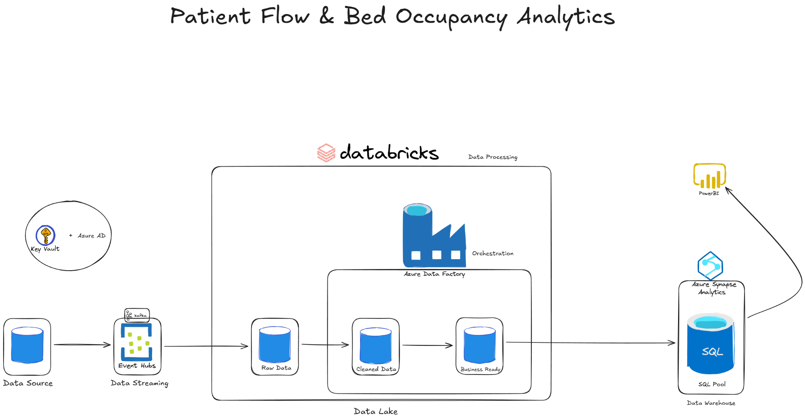
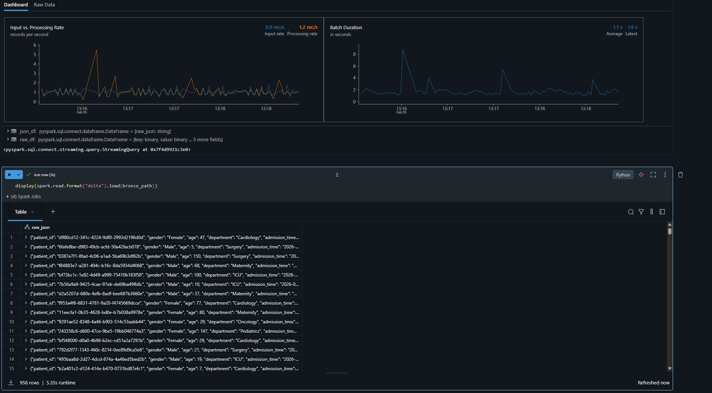
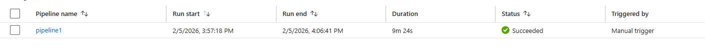
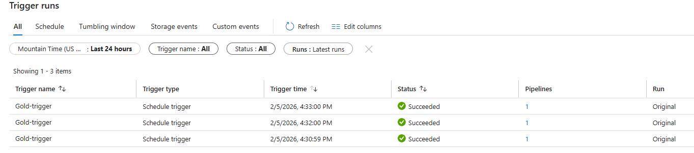
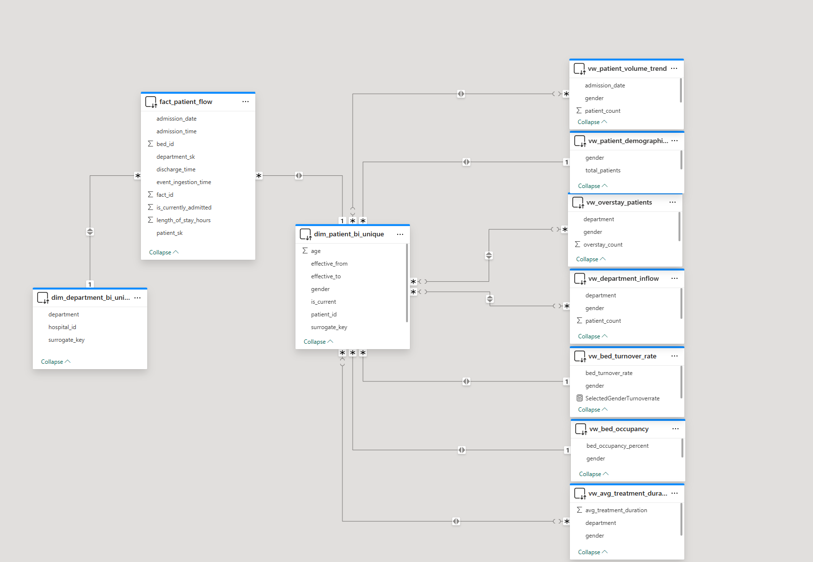

# Hospital Patient Flow Analytics (Real-Time Azure Pipeline)

A **real-time healthcare data engineering + analytics** project that simulates patient admissions/discharges across hospital departments, processes streaming data with **Databricks (PySpark)** using a **Medallion architecture (Bronze → Silver → Gold)**, and serves a **star schema** in **Azure Synapse SQL Pool** for **Power BI** reporting.

> **Synthetic data only.** No PHI/PII is used in this repo.

---

## Table of Contents

- [Project Overview](#project-overview)
- [Business Use Case (Client Requirements)](#business-use-case-client-requirements)
- [Architecture](#architecture)
- [Tools & Technologies](#tools--technologies)
- [Project Structure](#project-structure)
- [Data Architecture (Medallion)](#data-architecture-medallion)
- [Star Schema](#star-schema)
- [Step-by-Step Implementation](#step-by-step-implementation)
- [Synapse Analytics (Views & KPIs)](#synapse-analytics-views--kpis)
- [Power BI Dashboard](#power-bi-dashboard)
- [Key Outcomes](#key-outcomes)
- [Gotchas & Fixes](#gotchas--fixes)
- [License](#license)

---

## Project Overview

This project demonstrates a **real-time data platform for hospital patient-flow analytics**, designed to help operational leaders monitor:

- Bed occupancy and turnover
- Admissions volume over time
- Department-level bottlenecks
- Demographic slices (gender/age)

---

## Business Use Case (Client Requirements)

A simulated stakeholder request is used to drive the design:

**From:** Dr. Emily Carter (COO), Midwest Health Alliance (7 hospitals)  
**Need:** A centralized **near real-time** system to monitor bed occupancy, admission/discharge patterns, and department load.

Key requirements implemented in this project:

- Real-time admissions/discharges (streaming)
- Medallion architecture (Bronze → Silver → Gold)
- Dirty data simulation + Silver-layer remediation
- Star schema for analytics
- Orchestration + automation (ADF trigger)
- Monitoring + failure alerting

---

## Architecture

**Streaming:** Python/Kafka Producer → **Azure Event Hub**  
**Processing:** **Azure Databricks (Structured Streaming + Delta)**  
**Storage:** **ADLS Gen2** (Bronze/Silver/Gold)  
**Warehouse & BI:** **Synapse SQL Pool** (external tables + views) → **Power BI**



---

## Tools & Technologies

- **Azure Event Hub** — real-time ingestion
- **Azure Databricks** — PySpark ETL + Delta Lake
- **Azure Data Lake Storage Gen2 (ADLS)** — raw/curated storage
- **Azure Synapse Analytics (SQL Pool)** — analytics layer for BI
- **Azure Data Factory** — orchestration + scheduling + alerts
- **Power BI** — interactive dashboard (reporting layer)
- **Python 3.9+** — simulation + supporting scripts
- **Git / GitHub** — version control

---

## Project Structure

```text
hospital-patient-flow-analytics/
│
├── databricks-notebooks/
│   ├── 01_bronze_rawdata.py
│   ├── 02_silver_cleandata.py
│   └── 03_gold_transform.py
│
├── simulator/
│   └── patient_flow_generator.py
│
├── sqlpool-queries/
│   └── sql_pool_queries.sql
│
├── git_commands/
│   └── git_setup_commands.txt
│
├── diagrams/
│   └── (architecture diagrams)
│
├── screenshots/
│   └── (Power BI screenshots)
│
└── README.md
```

---

## Data Architecture (Medallion)

### Bronze (Raw)
- Stores raw JSON payloads from Event Hub
- Minimal transformation (binary → string → Delta)

### Silver (Cleaned + Conformed)
- Schema enforcement + type casting
- Null handling / timestamp correction
- Dirty data remediation (e.g., invalid age, future admission times)
- Basic schema evolution handling

### Gold (Analytics-ready)
- Star schema outputs (dimensions + fact)
- Surrogate keys
- Curated metrics (e.g., length of stay hours, currently admitted flag)
- Export-ready folders for Synapse consumption

---

## Evidence (pipeline running)

**Databricks streaming ingestion (Bronze):**  


**ADF pipeline runs + scheduled triggers:**  




**Power BI model (relationships):**  


---

## Step-by-Step Implementation

### 1) Event Hub setup
- Created Event Hub namespace + hub:
  - Namespace: `hospital-analytics-namespace2`
  - Hub: `hospital-analytics-eh`
  - Partitions: `1`
  - Retention: `1 hour`

### 2) Data simulation (Python → Event Hub via Kafka)
A generator streams synthetic patient events (department, timestamps, bed, etc.) and injects a small amount of dirty data.

**Important:** credentials are **not** committed to GitHub. Use environment variables or Key Vault for secrets.

Example event fields:
- `patient_id`, `gender`, `age`, `department`
- `admission_time`, `discharge_time`
- `bed_id`, `hospital_id`

### 3) Storage (ADLS Gen2)
Created containers:
- `bronze/`
- `silver/`
- `gold/`
- `synapseworkspace/` (workspace init / misc)

### 4) Databricks processing (Bronze → Silver → Gold)
Notebooks:
- `01_bronze_rawdata.py` — reads Event Hub stream (Kafka) and writes raw JSON to Bronze Delta
- `02_silver_cleandata.py` — parses JSON → typed columns; cleans + validates; writes Silver Delta
- `03_gold_transform.py` — builds dimensions + fact; writes Gold outputs in separate folders

**Secrets:** Databricks accesses Event Hub + ADLS keys via **Key Vault-backed secret scope**.

### 5) Orchestration & automation (ADF)
- Created an ADF pipeline that:
  - Checks for new files/child items in Silver
  - Runs the Gold notebook when a threshold is met (example: `>= 5` new items)
  - Triggered on a schedule (example: every 5 minutes)
- Configured an **Azure Monitor alert** for failed pipeline runs.

### 6) Synapse SQL Pool
- Created a dedicated SQL Pool
- Created:
  - Master key
  - Database scoped credential (Managed Identity)
  - External data source (ADLS)
  - External file format (Parquet)
  - External tables mapped to Gold exports
  - KPI views for Power BI

### 7) Version control (Git)
- Repo includes notebooks, simulator (without secrets), and Synapse SQL scripts.
- Credentials remain local / Key Vault.

---

## Synapse SQL (Up-to-date)

- `sqlpool-queries/00_external_tables.sql`
  - Master key
  - scoped credential (Managed Identity)
  - external data source (ADLS)
  - external file format (Parquet)
  - external tables (dim/fact)

- `sqlpool-queries/01_kpi_views.sql`
  - Occupancy %
  - Turnover rate
  - Patient counts
  - Department inflow
  - LOS averages
  - Overstay counts
  - Volume trend

---

## Power BI Dashboard

Power BI connects to Synapse SQL Pool and uses the star schema (fact + dimensions) plus KPI views.

Dashboard features:
- Bed occupancy % (gender slice)
- Volume trends over time (admission_date)
- Department inflow (current admitted)
- Average treatment duration (LOS)
- Overstay counts (LOS threshold)

- `screenshots/powerbi_dashboard.png`

---

## Key Outcomes

- **End-to-end pipeline:** streaming ingestion → medallion processing → analytics warehouse → BI dashboard
- **Scalable design:** easy to extend with new dimensions, measures, and rules
- **Operational insight:** realistic hospital KPIs for patient flow + bed utilization
- **Portfolio value:** demonstrates Azure, streaming, ETL, modeling, orchestration, and BI

---

## Gotchas & Fixes

### 1) ADLS endpoint mismatch (`core.windows.net` vs `dfs.core.windows.net`)
**Issue:** Writing with ABFS failed because the path used `...core.windows.net` instead of the ADLS Gen2 DFS endpoint.  
**Fix:** Always use the DFS endpoint with ABFSS paths:
```text
abfss://<container>@<account>.dfs.core.windows.net/<path>
```

### 2) Delta invalid partition path (`[DELTA_INVALID_PARTITION_PATH]`)
**Issue:** `patient_flow` folder in Gold already contained a Delta root (`_delta_log`). Writing to a nested path like `.../patient_flow/dim_patient` made Delta interpret `dim_patient` as a partition folder (must be `col=value`).  
**Fix:** Write each Gold table to a **separate base directory**, e.g.:
```text
.../patient_flow_gold/dim_patient
.../patient_flow_gold/dim_department
.../patient_flow_gold/fact_patient_flow
```

### 3) Join correctness in KPI views
**Issue:** Department joins were initially incorrect due to mismatched surrogate key joins.  
**Fix:** Ensure joins use the correct dimension surrogate key:
```sql
JOIN dbo.dim_department d ON f.department_sk = d.surrogate_key
```

---